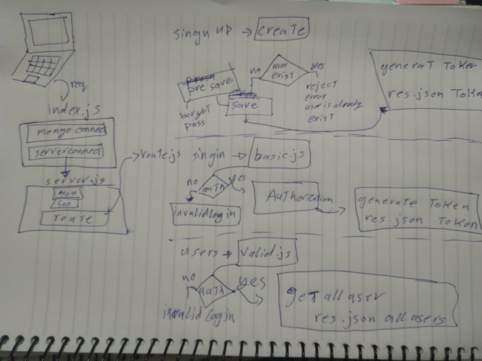

# LAB - Class 11 

## Project: auth-server

### Author: ahmad kaml

### Links and Resources

- [submission PR](https://github.com/401-advanced-javascript-ahmadkmal/auth-server/pull/1)
- [ci/cd](https://github.com/401-advanced-javascript-ahmadkmal/auth-server/pull/1/checks?check_run_id=748025115) (GitHub Actions)

<!-- - [back-end server url](http://xyz.com) (when applicable)
- [front-end application](http://xyz.com) (when applicable) -->

### Setup

colne the repo

#### `.env` requirements (where applicable)

- `SECRET`=AhmadKmal
- `PORT` - 3000
- `MONGODB_URI` - local one

#### How to initialize/run your application (where applicable)

- `npm start`
- `nodemon`

#### How to use your library (where applicable)

you can use it to make sign up and in functionality

#### Tests

- npm test

#### UML

